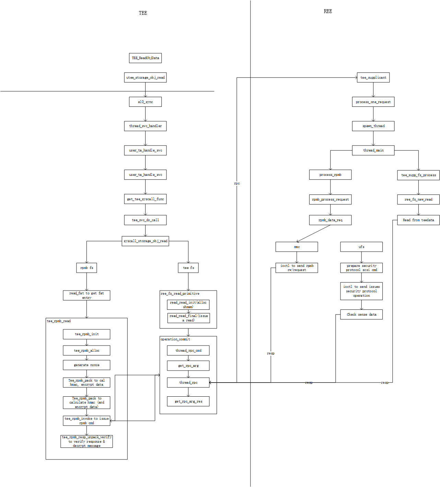
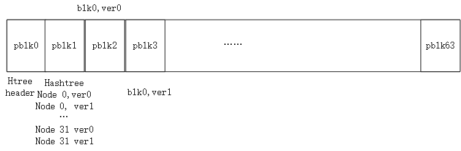
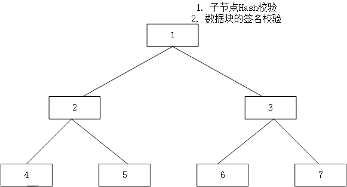

# REE FS

## Keys
- SSK: Secure Storage Key
```
    SSK = HMAC-SHA256(HUK, Chip ID || CONST_STRING)
```
- HUK: Hardware Unique Key
- TSK: Trusted application Storage Key
```
    TSK = HMAC-SHA256(SSK, TA_UUID)
```
- FEK: File Encryption Key
```
    PRNG生成，TSK加密后存放在文件元数据(HashTree Header/FAT Entry)中
```
## Optee & Tee-Supplicant

## 文件结构
```
在reefs中，每个block的大小为4KB, reefs中每个文件由如下循环结构构成(64 * 4KB)
```


```
再每个上述结构中，pblk0/pblk1 为元数据区，分别采访HashTree Header(*2)以及HashTree, 后续62个block分别对应文件的31个block，对于文件的每个block，分别存在2份物理block对应ver 0以及ver 1, 用于实现原子更新
```

## HashTree
```
在REE FS中，HashTree是一颗简化版的可持久化完全二叉树, 每个节点包含2个版本(ver 0, ver 1)
```


### HashTree Header的校验


