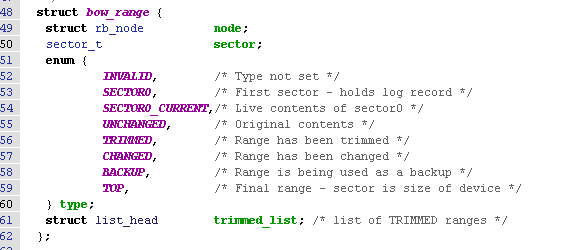
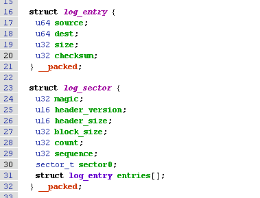
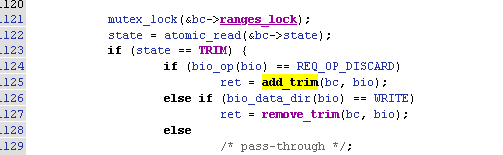
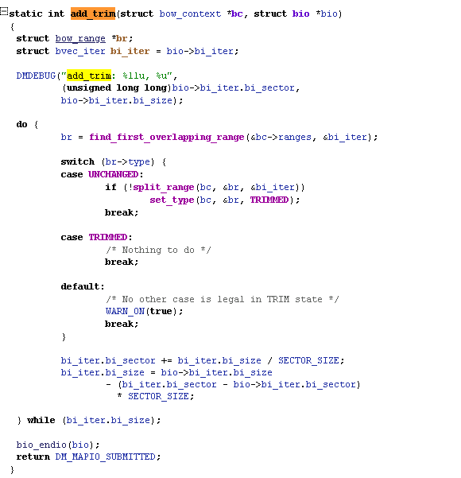
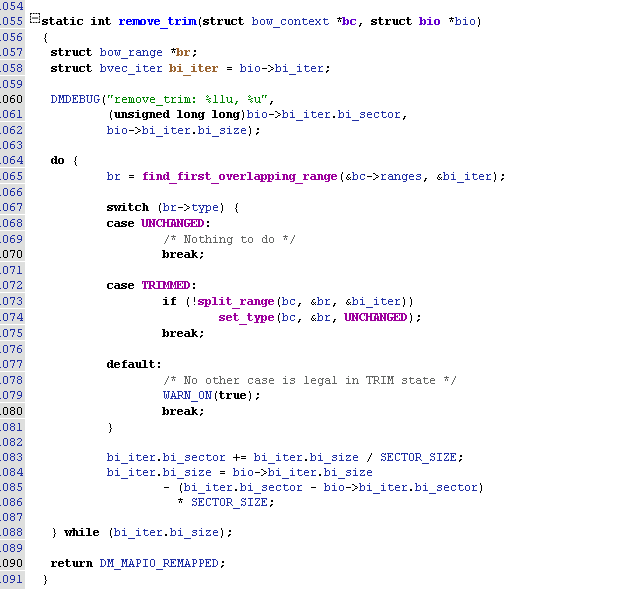
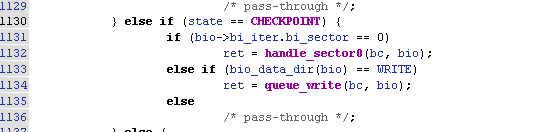
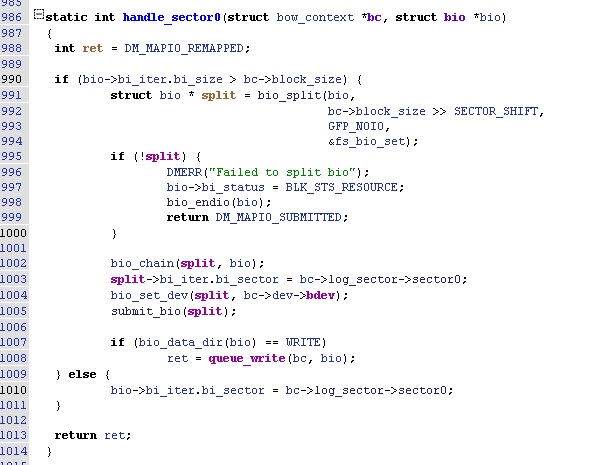

# DM-BOW

## Overview

```
dm-bow(Backup On Write) 会利用block设备的剩余空间来备份被覆盖(更新)的数据，在
Android Q版本后，dm-bow被用于AB升级失败后userdata数据的回退
dm-bow 与dm-snapshot中COW(Copy On Write) 较为类似
```

## DM-BOW Device Status

```
There is Three Status For DM-BOW
- TRIM (0)
- CHECKPOINT (1)
- COMMIT (2)
可以通过向/sys/block/dm-x/dm/bow/state节点写数据以更改DM-BOW设备状态
```


### TRIM Status

```
此时dm-bow会收集被trim的block, 进行合并后添加到bow_range tree中, 类型记录为TRIMMED, 用于后续的备份覆盖写数据。

dm-bow设备创建完成后，状态为trim(0)
dm-bow设备进行挂载后，应该立即执行FITRIM操作，以确保dm-bow拥有空间进行备份。并且设置dm-bow状态为CHECKPOINT.
```

#### TRIM
  ```
  当dm-bow设备处于TRIM状态时，会收集trim操作回收的block, 将这些block合并后插入到dm-range set中, 并标记为TRIMMED状态。
  ```

#### WRITE
  ```
  对于写操作，dm-bow会判断block是否为TRIMMED状态。将block从TRIMMED状态中移除，改为UNCHANGED状态
  ```

#### OTHER
  ```
  对于其他操作，dm-bow是一个passthrough设备
  ```

### CHECKPOINT
```
当dm-bow处于CHECKPOINT状态时，dm-bow会对覆盖写的数据进行备份操作，并且将更新记录添加到日志. CHECKPOINT具体流程将在后续章节详细介绍
```

#### WRITE

  - 对于覆盖更新，会为其创建备份
  - 对于请求设备第一个block, 会映射到sector0_current
  - 对于新增的block, 将bow-range set中该block类型修改为CHANGED即可

#### READ
  - 对于请求设备第一个block, 会映射到sector0_current

#### OTHER
  - passthrough 设备

### COMMIT
```
  当切换到COMMIT状态时，恢复sector0, 删除dm-bow状态信息. 此时dm-bow仅作为一个passthrough设备
```

## Bow-Range
- bow-range用于维护一段具有相同类型并且地址连续的block信息，bow-range具有如下类型
  - INVALID
  - TOP
  - SECTOR0
  - SECTOR0_CURRENT
  - CHANGED
  - UNCHANGED
  - TRIMMED
  - BACKUP
- bow-range均会被存放在bow-range set中进行统一管理
- bow range的数据结构如下

  
### TOP
- 描述整个设备
- 此时sector不在描述起始地址，而是整个设备大小
- dm-bow设备刚完成创建时，会在bow-range set中添加此种类型的bow-range

### SECTOR0
- 设备的第一个扇区，作为dm-bow的日志块
- 如下图sector0 会指向原设备的正在第一个sector数据的地址


### SECTOR0_CURRENT
- 存放原设备真正sector0的数据

### UNCHANGED
- 描述未改变的block
- dm-bow设备刚完成创建时，认为整个设备均为UNCHANGED状态，因此会在bow-range set中添加此种类型的bow-range描述整个设备

### CHANGED
- 当UNCHANGED区域数据发生改动时，会将该区域改为CHANGED状态
- 再次修改CHANGED BOW-RANGE，无需进行任何改动

### BACKUP
- 描述备份数据

### TRIMMED
- 已经被trim的block
- 对于修改trimmed状态的block，认为是新增数据

## Key Flow
### Device Init

- dm-bow接收只如下参数
    - 设备节点 -- argv[0]
      - 必选
    - block_size -- argv[1] 形如: block_size:%d
      - 可选，若未指定block_size，则将从block_dev中获取block size
- dm_bow_ctr
  ```
  1. 创建workqueue用于执行bow_write work
  2. 构造rb tree, 作为bow-range set
  3. 创建top类型的bow-range, 插入bow-range set
  4. 创建unchanged 类型bow-range，代表整个设备未发生改变，插入bow-range set中
  ```

### TRIM流程
- 如 [TRIM状态](#trim-status) 中描述，TRIM状态主要处理TRIM/WRITE操作



- add_trim



```
   如上图，add_trim将在bow-range set中需要落在其范围的bow-range
   1. 若找到的bow-range状态为TRIMMED，说明已经进行了处理，无需进一步操作
   2. 若找到的bow-range状态为UNCHANGED, 则分裂该bow_range，将修改涉及的bow-range状态设置为TRIMMED
   3. 其他为非法状态
```
- remove_trim

  

```
与add_trim类似，remove_trim将会TRIM类型，将其改为UNCHANGED类型
```
### CHECKPOINT流程
- 刚进入CHECK状态时，会创建日志
  ```
  1. 对平台原有的sector0进行备份，记录为sector0_current
  2. sector0_current记录到日志块头部中
  3. 构建日志块
  4. 日志块写入sector0
  ```
- 如 [CHECKPOINT状态](#checkpoint) 章节描述，此时dm-bow将处理sector0以及覆盖写数据备份



- SECTOR0_CURRENT
  ```
  由于block设备原本的sector0被作为日志，一次对于读写sector0需要进行重新映射到真正的block
  ```


- SECTOR0
  ```
    对sector0数据进行备份，将备份作为第一项插入到日志中(这样所有日志block形成了一个链表)
  ```
- CHANGED
  ```
  由于dm-bow device创建后该已经写过，一次无需处理，直接写入该block
  ```
- TRIMMED
  ```
  认为是新增block, 直接更新即可。block类型改为CHANGED
  ```
- UNCHANGED
  ```
  认为是覆盖写，需要对原block数据进行备份，添加记录到日志中, 并且block类型
  ```
- BACKUP
  ```
  作为backup的block被文件系统写入(实际上为新增block), 流程与UNCHANGED类似，需要对block进行备份，再写入该block，并且标记为CHANGED
  ```

### COMMIT流程
```
  利用sector0_current恢复sector0 数据， 此后dm-bow为passthrough设备
```
