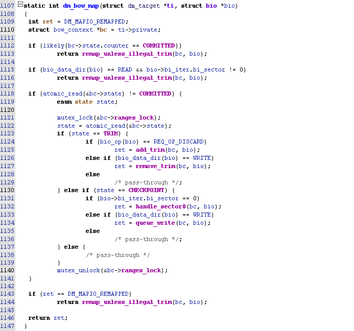

# DM-BOW

## Overview

```
DM-BOW(Backup On Write) is a device-mapper target driver for backup the overwrite data. In Android Q, it's used for impliment User Data Checkpoint(UDC) 
```

## DM-BOW Device Status

```
There is Three Status For DM-BOW
- TRIM (0)
- CHECKPOINT (1)
- COMMIT (1)
status can be changed by write value to /sys/block/dm-x/dm/bow/state
```



### TRIM Status

```
When dm-bow device in trim status, dm-bow will collect trimmed block.
The device will fall into trim status once dm-bow device is created
```

#### trim operation
  ```
  dm-bow will 
  ```

#### write operation
  ```
    dm-bow will check whether the block exists in trim
  ```

#### other operation
  ```
  ```